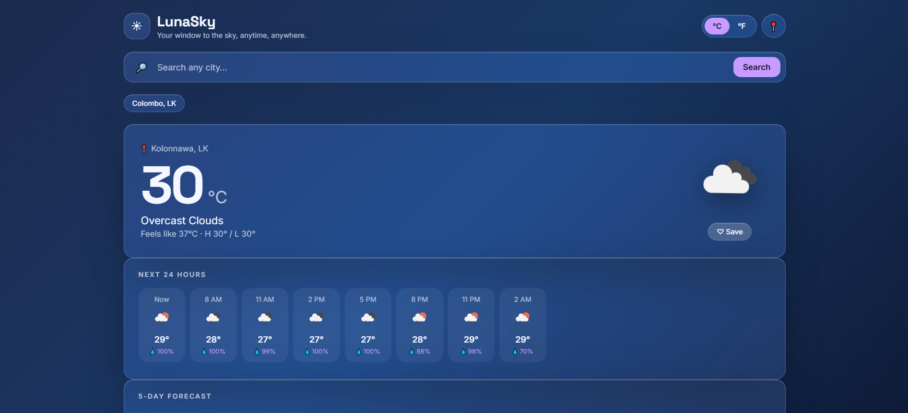

# 🌤 LunaSky — Weather App

A responsive weather web app built with HTML, CSS, and JavaScript using the OpenWeatherMap API.

## 🔗 Live Demo
[nuwanichandrasiri.github.io/weather-app-javascript](https://nuwanichandrasiri.github.io/weather-app-javascript)

## ✨ Features
- 🌡 Live weather data for any city worldwide
- 📍 Auto-detects your location on load
- ⏱ 24-hour hourly forecast
- 📅 5-day weather forecast
- 💨 Wind, humidity, pressure, visibility stats
- 🌅 Sunrise & sunset times
- ⭐ Air quality index
- ❤️ Save favourite cities
- 🔄 °C / °F toggle
- 💾 Persists favourites and recent searches via localStorage

## 🛠 Built With
- HTML5
- CSS3 (Glassmorphism UI)
- JavaScript (Async/Await, Fetch API)
- [OpenWeatherMap API](https://openweathermap.org/api)

## 📸 Preview

## 🚀 Getting Started
1. Clone the repo
2. Get a free API key from [openweathermap.org](https://openweathermap.org)
3. Replace the `API_KEY` value in `script.js` with your key
4. Open `index.html` in your browser

## 👩‍💻 Author
**Nuwani Chandrasiri**  
BSc (Hons) Software Engineering — KIU Sri Lanka  
[LinkedIn](https://linkedin.com/in/nuwani-chandrasiri-dev) · [GitHub](https://github.com/nuwanichandrasiri) · [Portfolio](https://nuwanichandrasiri.github.io/portfolio)
